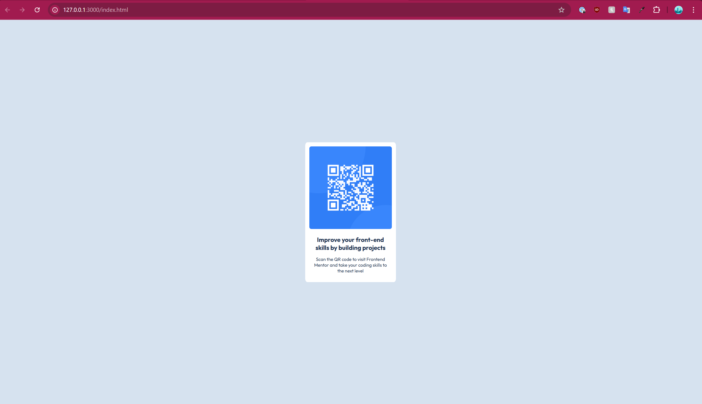

# Frontend Mentor - QR Code Component Solution

This is my solution to the [QR Code Component Challenge on Frontend Mentor](https://www.frontendmentor.io/challenges/qr-code-component-iux_sIO_H). Frontend Mentor challenges help developers improve their coding skills by building realistic projects.

## Table of Contents

- [Overview](#overview)
  - [Screenshot](#screenshot)
  - [Links](#links)
- [My Process](#my-process)
  - [Built With](#built-with)
  - [What I Learned](#what-i-learned)
  - [Continued Development](#continued-development)
  - [Useful Resources](#useful-resources)
- [Author](#author)
- [Acknowledgments](#acknowledgments)

## Overview

### Screenshot



### Links

- Solution URL: [GitHub Repository](https://github.com/jayco01/qr-code-component.git)

## My Process

### Built With

- Semantic HTML5
- CSS3
- Flexbox
- Mobile-first workflow

### What I Learned

During this challenge, I improved my CSS flexbox skills, better understood how to align and structure content efficiently, and refined my ability to center elements both horizontally and vertically.

Additionally, I learned how to import Google Fonts directly into my HTML files without downloading them. Here’s an example:

```html
<link href="https://fonts.googleapis.com/css2?family=Outfit:wght@400;700&display=swap" rel="stylesheet">
```

This allows me to apply fonts in my CSS like this:

```css
body {
  font-family: 'Outfit', sans-serif;
}
```

### Continued Development

I want to improve my research skills in programming. Since I am still new to programming, I often struggle with knowing what to search for when I run into issues. I believe that improving my ability to browse the web effectively—knowing what keywords to use, which websites to check, and how to identify useful information—will be key to becoming a better developer.

### Useful Resources

- [Stack Overflow](https://stackoverflow.com/) - Helped me troubleshoot issues and find quick solutions.
- [W3Schools](https://www.w3schools.com/) - Great reference for HTML and CSS concepts.
- [Dani Krossing's YouTube Video](https://www.youtube.com/c/DaniKrossing) - I specifically watched his tutorial on **"How to Import New Fonts Using HTML."**

## Author

- LinkedIn - [Jay Vincent Layco](https://www.linkedin.com/in/jay-vincent-layco-39184116b/)

## Acknowledgments

This project was provided by [Frontend Mentor](https://www.frontendmentor.io/). I completed this challenge independently as part of my learning journey.
